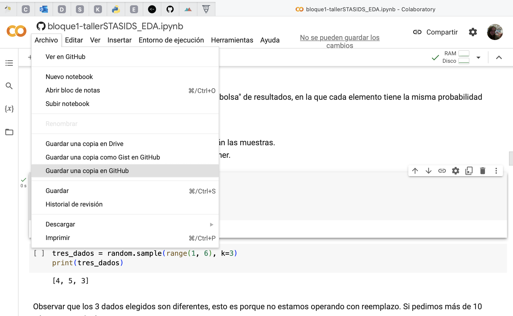

# Taller Estadística para Data Science

Docente: Melanie Oyarzún

E-Mail: moyarzunw@udd.cl

Fecha: 12 agosto 2023

Repositorio complementario con material de apoyo para taller de Estadística para Data Science

## Generalidades

### Descripción
El taller se divide en dos bloques, cada uno tiene un notebook que lo acompaña.

- El primer bloque revisaremos conceptos claves de la estadística y su aplicación concreta en análisis exploratorio de datos. [ Link Notebook bloque 1](https://github.com/melanieoyarzun/taller_estadisticaDS/blob/main/actividad_tallerSTATSIDS.ipynb)

- En el segundo bloque revisaremos conceptos asociados a la inferencia estadística y su aplicación en pruebas de hipotesis y experimentos aleatorios.
[ Link Notebook bloque 2](https://github.com/melanieoyarzun/taller_estadisticaDS/blob/main/bloque2-tallerSTATSIDS_inferencia.ipynb)

### Evaluación

Durante ambos bloques trabajaremos en una actividad de ejercitación que será evaluada, este puede ser de manera individual o en grupo de hasta 3 personas.  El enunciado estaá disponible en [link actividad](https://github.com/melanieoyarzun/taller_estadisticaDS/blob/main/actividad_tallerSTATSIDS.ipynb)

- La entrega es hasta el día lunes 28 AGO en el correo: moyarzunw@udd.cl,
- Enviar por correo con el asunto: Tarea taller serie de tiempo IDS, nombre apellido
- El notebook debe tener el nombre: Notebook- taller-aplicacion-nombre-apellido.ipnyb,
- Tambien puede enviarme un link en github si está publico o me concede acceso.

---

## Guía: Acceso y edición del repositorio

Para el trabajo en la sesión, se recomienda trabajar en una copia personal de este repositorio. Para esto, recomiendo crear un "fork" en tu propia cuenta de github (esto para poder editarlo facilmente y también poder actualizarlo facilmente).

1. Log in (o registrarse) en [https://github.com](https://github.com)
2. Entrar al repositorio del curso [https://github.com/melanieoyarzun/taller_seriestiempo_IDS](https://github.com/melanieoyarzun/taller_seriestiempo_IDS)
3. Realizar un fork 
   

### opcion 1: Clonar directamente en su equipo y trabajar desde ahi

4. Desde **TU repositorio** Fork, usa la pestaña code para tener acceso directamente a los archivos de la carpeta y editarlos localmente (decsargar .zip) o abrir con github desktop

Luego trabaja con tu editor de confianza. Yo uso VScode.

Tambien puedes correrlo en la web usando .

### opción 2: Acceder al repositorio desde Google Colab

4. Desde tu Fork, usa la pestaña code para tener acceso directamente al link del repositorio

5. Logueado en tu cuenta google, entra a [https://colab.research.google.com/github](https://colab.research.google.com/github) y peqga la url del repositorio y haz click en incluir repositorios privados

6. Elige el notebook correcto y tendras acceso al que desees

7. Para guardar cambios, puedes hacerlo en tu git, o una copia en drive.

8. Trabaja y ejecuta como de costumbre

NOTAS de trabajar en Colab:

Muchas veces los accesos directos a dependencias de carpeta puede que no funcionen, asi que es imporotante tenerlos alojados en sitios web o subir mientras se trabaja. 

Si usas librerías no estándar, necesitarás instalarlas para poder usarlas.

En nuestro caso ambas consideraciones no son relevantes, pues usaremos datos simulados, desde la libreria Seaborn o cargados en github.